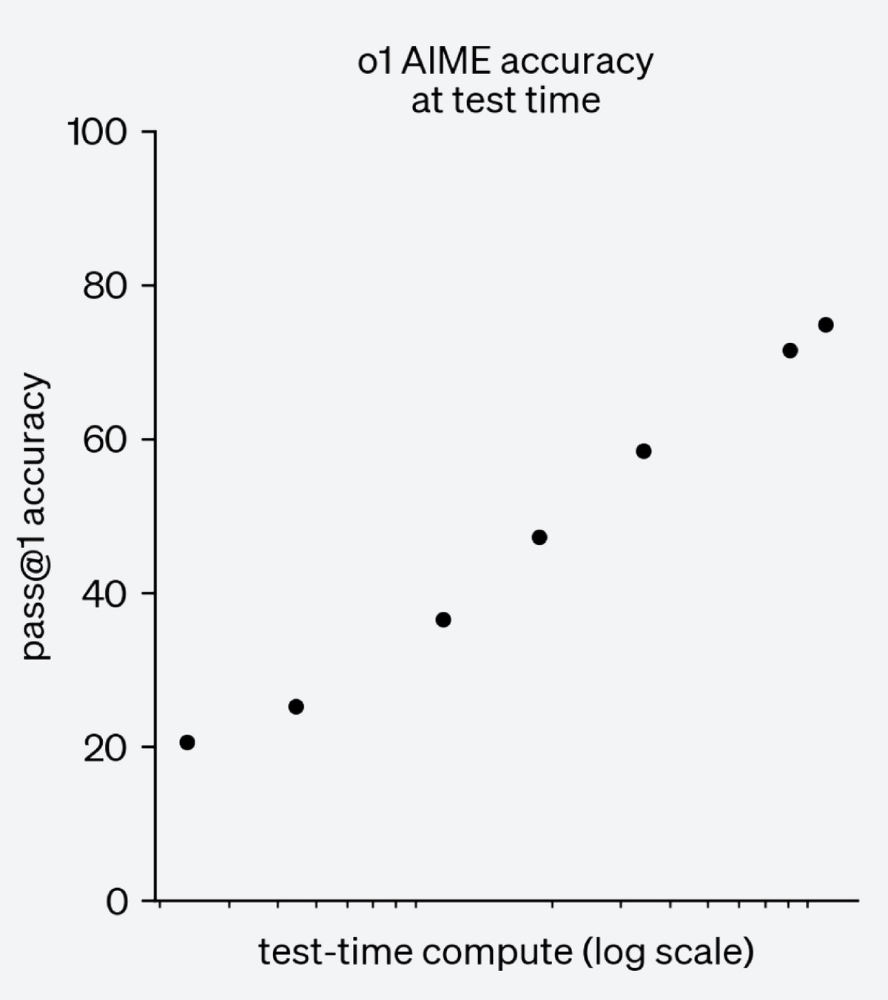
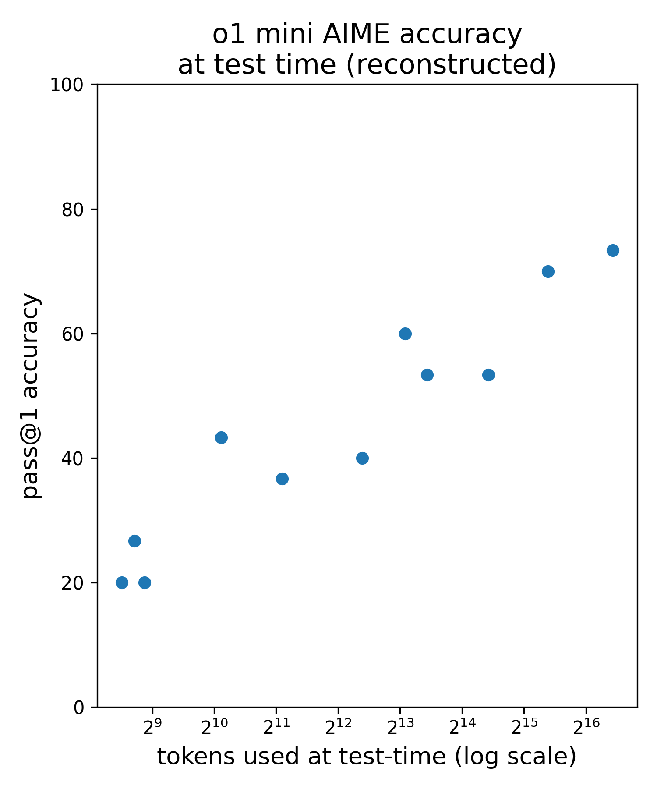
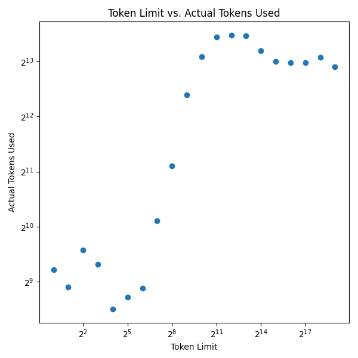
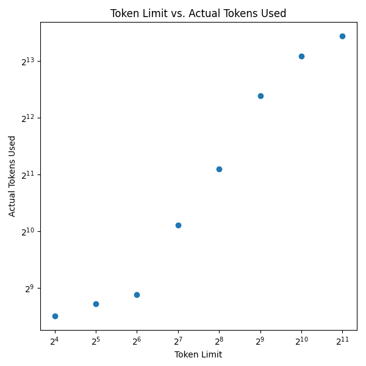
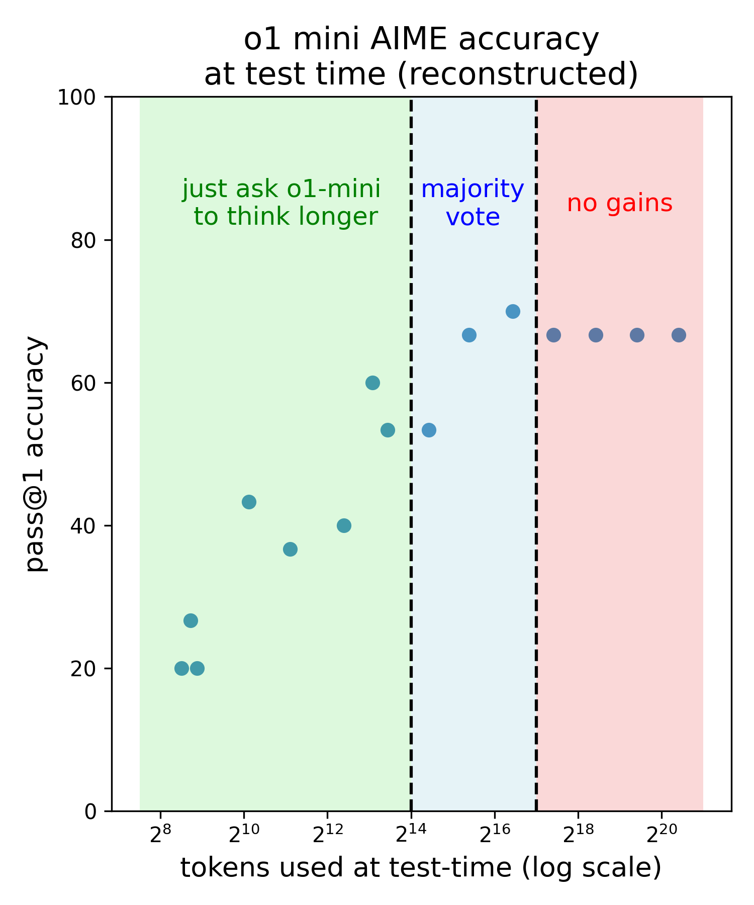

# O1 Test-Time Compute Scaling Laws

## Overview

Two weeks ago, OpenAI released the o1 family of models along with a graph showing scaling laws for inference time compute. Using only the public o1-mini API, I tried to reconstruct the graph as closely as possible. The original is on the left, my attempt is on the right.

  
  

## Methodology

We evaluate on the 30 questions that make up the 2024 American Invitation Mathematics Examination (AIME). These are kindly provided by Project Numina [here](https://huggingface.co/datasets/AI-MO/aimo-validation-aime/viewer/default/train).

The OpenAI API does not allow you to easily control how many tokens to spend at test-time. I hack my way around this by telling o1-mini how long I want it to think for. Afterwards, I can figure out how many tokens were actually used based on how much the query cost!

Here's a plot of how many tokens we ask o1-mini to think for against how many it actually uses. If you request a very small token budget, it often refuses to listen. The same for large token budgets. But requesting between $2^4$ and $2^{11}$ tokens seems to work reasonably well.

  
  

When restricting to just that region of $2^4$ to $2^{11}$, we get the following curve. Note that o1-mini doesn't really "listen" to the precise number of tokens we ask it to use. In fact, in this region, it seems to consistently use ~8 times as many tokens as we ask for!

## Majority Vote / Self Consistency

This only gets us ~$2^{14}$ = 16K tokens spent at test-time. Despite fiddling with various prompts, I was unable to get the model to reliably "think" longer. To scale further, I took a page from the [self-consistency paper](https://arxiv.org/abs/2203.11171) by doing repeated sampling and then taking a majority vote.

One natural question when seeing scaling laws graphs is: how long does this trend continue? For the original scaling laws for pre-training, each additional datapoint cost millions of dollars so it took some time to see the additional datapoints. In this case, for scaling inference, the reconstructed graph was surprisingly cheap to make. $2^{17}$ tokens / problem * 30 AIME problems from 2024 = ~4M tokens. At \$12 / 1M output tokens, the largest inference run only costs about \$50. o1-mini really isn't that expensive!

Sadly, self-consistency / majority vote doesn't seem to scale much past the initial gains. I increased the samples 16x beyond the most successful run, but there are no more gains beyond $2^{17}$ total tokens and getting ~70%, which is just under what the original OpenAI graph showed. This is consistent with past work suggesting that majority voting saturates at some point (classic statistics says something similar too).

## Conclusion

Note that this is a reconstruction, not a replication. I don't know how the original graph was made, and do NOT claim that it was made using the methodology here. Also, this graph uses o1-mini (over o1-preview because of speed/cost), not o1 (unreleased), which the original uses. o1-mini is also better than o1-preview at math (including AIME) anyways.